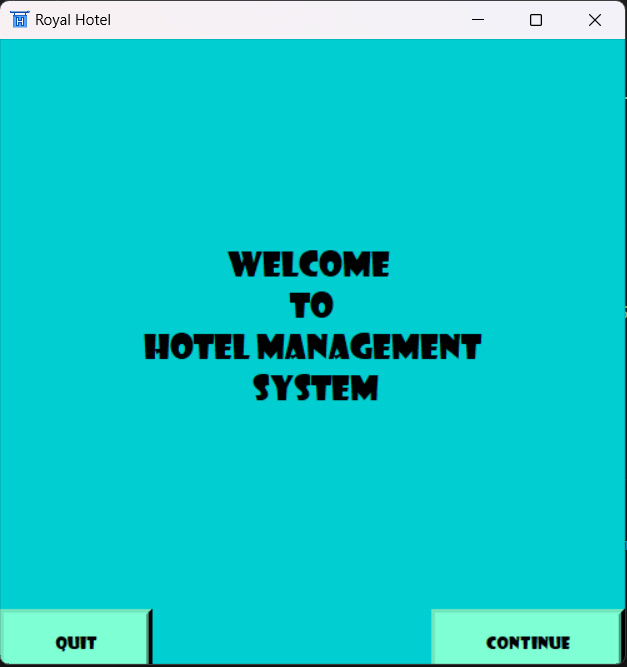

# Hotel Management System GUI

This project is a graphical user interface (GUI) for a hotel management system. The interface is built mainly using the Tkinter library and the Pillow library.Tkinter library used for make the user interface and Pillow library used to add images to it.The backend database is managed with SQLite.

There are two main sections in this system
- Customer Section
- Admin Section

## Customer Section

- **Sign Up**: Any customer can create a profile.
- **Sign In**: Customers who have a profile can log in to their account.
- **Profile**: Any customer can view their profile and edit their informations and the login password.
- **Book a Room**: Customers can book a room.
- **Booking Details**: Customers can view their booking details.
- **Room Categories**: Customers can view details of Room Categories.
- **Meal Plans**: Customers can view details of Meal Plans.
- **Available Discounts**: Customers can view currently available discounts.

## Admin Section
- **Profile**: Any admin can view their profile and edit their informations and the login password.
- **Customers**: Admins can view customer profiles and handle them.
- **Check In**: Admins can check details about Check Ins 
- **Check Out**: Admins can check details about Check Outs 
- **Rooms**: Admins can check and edit details of Rooms
- **Reports**: Admins can check reports of Customers
- **Add Admin**: Admins can add more Admins
- **Meal Plans**: Admins can check and edit details of Meal Plans
- **Discounts**: Admins can check and edit details of Discounts

## Features

- **User-Friendly Interface**: Simple and intuitive design for ease of use.
- **Room Management**: Add, edit, delete, and view rooms.
- **Guest Management**: Register, update, and manage guest information.
- **Booking Management**: Handle room bookings.
- **Billing**: Generate invoices and process payments.
- **Report Generation**: Create reports for bookings, payments, and guests.
- **Image Support**: Use images for rooms and guests with the help of the Pillow library.

## Technologies Used

- **Python**: The programming language used for the project.
- **Tkinter**: Library used for creating the graphical user interface.
- **Pillow**: Library used for image handling within the GUI.
- **SQLite**: Database system used for managing data.

## Acknowledgements

- Tkinter: https://docs.python.org/3/library/tkinter.html
- Pillow: https://python-pillow.org/
- SQLite: https://www.sqlite.org/index.html
